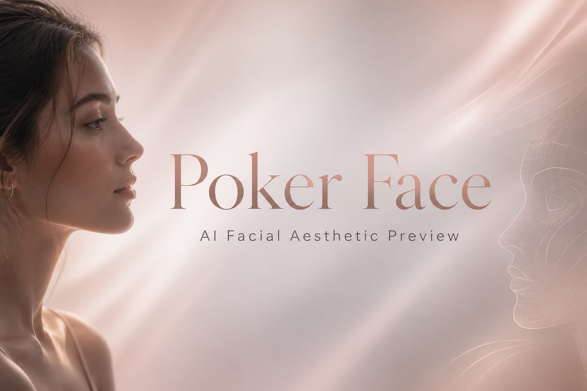

<p align="center">
  
</p>

<p align="center">
  <a href="README.zh-CN.md"></a>
  &nbsp;
  <a href="README.md"></a>
</p>

---

# Poker Face（扑克脸）

Poker Face 是一款桌面优先的网页应用，面向 18–55 岁女性用户。上传自拍后，即可私密预览可能的面部美学变化，帮助在真实决策前进行可视化探索。

> 本产品仅为可视化与教育工具，不是医疗器械，也不能替代持证专业人士的建议。

## Space 配置

| 字段 | 值 |
| --- | --- |
| title | Poker Face |
| emoji | 🃏 |
| colorFrom | pink |
| colorTo | gray |
| sdk | docker |
| app_port | 7860 |
| pinned | false |

## 快速开始

1. 将 `.env.example` 复制为 `.env`，并填入中继 API Key。
2. 运行 `python server.py`。
3. 在浏览器打开 `http://127.0.0.1:8000`。

当前 MVP 无需安装第三方 Python 依赖。

## MVP / V1 决策

| 主题 | 决策 |
| --- | --- |
| 生成 | 必须使用真实 AI 生图 |
| 当前模型 | `gpt-image-2` |
| 中继 | OpenAI 兼容 API |
| Gemini | 仅保留注释参考代码 |
| 平台 | 桌面优先网页应用 |
| 画廊 | Pinterest 风格瀑布流 |
| 账号 | V1 不需要账号 |
| 存储 | 仅用 `localStorage` 保存轻量 UI 状态 |
| 图片 | **禁止**将 base64 图片写入 `localStorage` |
| 真实感 | 保守、保持身份一致的微调 |

## 当前实现

- 基于 Python 标准库的 Web 服务：`server.py`
- 静态前端位于 `static/`（Vercel 部署使用 `public/`）
- 通过 OpenAI 兼容中继调用 `gpt-image-2` 进行图片编辑
- 桌面优先瀑布流画廊 + 左侧效果筛选面板
- 按效果展示生成状态，可恢复错误卡
- 前端单张生成超时 150 秒
- 开发热重载监视器 + 前端轮询 `/api/dev-version`

## 常用命令

| 操作 | 命令 |
| --- | --- |
| 开发启动 | `python server.py` |
| 打开应用 | `http://127.0.0.1:8000` |
| Python 语法检查 | `python -m py_compile server.py` |
| JS 语法检查 | `node --check static\app.js` |
| 安装依赖 | 当前无需安装 |
| 构建 | 当前无需构建 |
| 代码检查 | 暂未配置 |

`python server.py` 会启动无依赖开发监视器，下列文件变更时自动重启子进程：

- `server.py`
- `.env`
- `.env.example`
- `README.md`
- `AGENTS.md`
- `static/` 下任意文件

前端每秒轮询 `/api/dev-version`，后端重启令牌变化时自动刷新页面。

## 环境配置

运行前将 `.env.example` 复制为 `.env`。**请勿提交真实 API Key。**

真实生成所需：

- `POKER_FACE_RELAY_URL`
- `POKER_FACE_RELAY_API_KEY`

```bash
PORT=8000
POKER_FACE_MODEL=gpt-image-2
POKER_FACE_RELAY_URL=https://deepsy.top
POKER_FACE_RELAY_API_KEY=replace-with-your-relay-api-key
POKER_FACE_RELAY_FORMAT=openai
POKER_FACE_RELAY_AUTH=bearer
POKER_FACE_REQUEST_TIMEOUT=120
```

可选：

- `PORT` — 默认 `8000`
- `POKER_FACE_MODEL` — 默认 `gpt-image-2`
- `POKER_FACE_RELAY_FORMAT` — 默认 `openai`
- `POKER_FACE_RELAY_AUTH` — 默认 `bearer`
- `POKER_FACE_REQUEST_TIMEOUT` — 默认 `120`

## 中继 API 约定

当前路径通过 OpenAI 兼容中继调用 GPT 图片生成。

- `POKER_FACE_RELAY_FORMAT=openai`：发送包含 `model`、`prompt`、`image[]`、`n`、`size`、`quality` 的 multipart 图片编辑请求。

`POKER_FACE_RELAY_URL` 可以是：

- 基础 URL → 自动追加 `/v1/images/edits`
- `/v1` URL → 自动追加 `/images/edits`
- 已完整指向 `/images/edits` 的端点

支持 OpenAI `b64_json`、直接 `url`，或其他通用 base64 字段。

## 后端 API

### `GET /api/config`

返回模型、中继、就绪状态、中继格式与存储状态。

### `GET /api/dev-version`

返回当前开发热重载令牌。

### `POST /api/generate`

生成一张编辑后的预览图。

请求：

```json
{
  "image": "data:image/png;base64,...",
  "effectId": "under_eye",
  "label": "Under-eye",
  "intensity": "balanced"
}
```

响应：

```json
{
  "result": {
    "id": "under_eye-1784172558294",
    "effectId": "under_eye",
    "label": "Under-eye",
    "image": "data:image/png;base64,...",
    "createdAt": 1784172558,
    "prompt": "..."
  }
}
```

## 目标用户

- 18–55 岁女性
- 对美容或外观变化好奇的用户
- 希望私密、低压力对比效果的用户
- 咨询前或消费前希望先看效果的用户

## 核心体验

1. 上传清晰正脸照片。
2. 选择一个或多个外观预览效果。
3. 基于上传照片生成真实感预览。
4. 在瀑布流画廊中浏览结果。
5. 将任意结果设为精选预览。
6. 左右对比原图与效果图。
7. 收藏切换、删除、重新生成，或清空本地会话。

## 结果画廊布局

- 小屏约 3 列瀑布流；桌面端 4 列
- 通过卡片尺寸规则突出精选预览
- 高低错落、间隙紧凑、圆角 8px
- 图片铺满卡片边缘
- 左侧粘性栏：上传、强度、筛选、操作与状态

## 外观预览效果

当前默认可选集包含 **20** 个效果：

1. 缩小鼻子
2. 鼻梁塑形
3. 鼻头精修
4. 丰唇
5. 上唇增强
6. 下唇增强
7. 狐狸眼提升
8. 眉部提升
9. 眼睑提升
10. 面部提升
11. 下颌线
12. 下巴精修
13. 面颊丰盈
14. 颧骨轮廓
15. 前额抚平
16. 鱼尾纹淡化
17. 眼下提亮
18. 肤色调整
19. 肤质平滑
20. 面部瘦脸

进度按所选数量显示，例如 `2 of 3`。

## 画廊交互

- 点击卡片设为精选。
- 对比选中图与原图。
- 生成前可调节提示强度。
- 可收藏、删除或单效果重生成。
- 失败效果可重试，不影响已成功结果。

## 加载与空状态

**生成前**

- 显示已上传图片与所选效果数量。

**生成中**

- 结果逐步填入卡片。
- 显示进度，如 `8 of 20`。
- 显示当前状态，如 `Generating Under-eye`。

**若生成失败**

- 标明失败效果并允许重试。
- 保留已成功结果。
- 可恢复错误时继续其余效果。
- 配置、鉴权或模型硬错误时停止。

## 前端状态与存储

轻量状态保存在 `localStorage`，键名为：

```text
poker-face-session-v1
```

保存字段包括所选效果 ID、选中卡片 ID，以及少量结果元数据。

上传图与生成图的 base64 **不会**写入 `localStorage`，仅保存在当前页面会话的浏览器内存中。

若保存失败，`safeSaveState()` 会记录问题，生成流程仍继续。

## 重要产品原则

- 结果必须标注为模拟效果。
- 不承诺医疗准确性或真实手术效果。
- 鼓励术前咨询持证专业人士。
- 将上传照片视为敏感个人数据。
- 避免羞辱自然面部特征的措辞。
- 产品语气应支持、中立、清晰。
- 标签不得遮挡眼、鼻、唇等关键区域。

## 隐私要求

- 处理照片前征求同意。
- 明确保留规则。
- 允许清空本地会话中的上传图与生成结果。
- 未经明确同意，不得将照片用于训练或营销。
- 勿提交 `.env`、API Key、用户照片、生成人脸图或日志。

## MVP 验收标准

- 可上传一张人脸照片。
- 可选择一个或多个预览效果。
- 通过已配置中继生成真实感预览。
- 以瀑布流拼贴展示结果。
- 可选精选预览并与原图对比。
- 可从本地会话删除上传图与生成图。
- 页面可见模拟免责声明。
- 生成图不持久化到 `localStorage`。

## 未来功能

- IndexedDB 或后端临时图片存储
- 下载生成预览
- 多效果组合预览
- 可调强度滑杆
- 已保存造型合集
- 咨询准备笔记
- 移动端优先拍照上传流程

## Git 说明

Git 已忽略的运行时文件：

- `.env`
- `__pycache__/`
- `*.pyc`
- `server.out.log`
- `server.err.log`

## 参考资料

- [CODEX FULL COURSE: From Zero to Deployed App (2026)](https://www.youtube.com/watch?v=hoCWD1aI60Y&t=4662s)

## 安全声明

Poker Face 仅提供视觉模拟效果。结果可能与真实医美手术、护肤、化妆或医疗结果不一致。用户在做出医疗、美容或财务决策前，应咨询合格专业人士。
